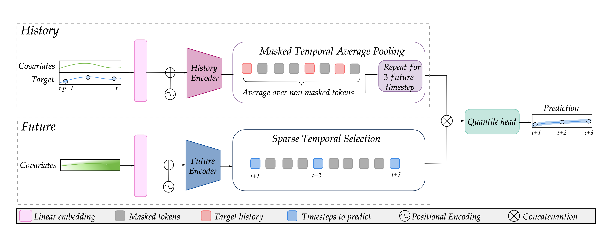

<div align="center">
<h1>Probabilistic NDVI Forecasting from Sparse Satellite Time Series and Weather Covariates
</h1>

[Irene Iele](https://scholar.google.com/citations?user=srLH7lkAAAAJ&hl=it&oi=ao)<sup>1</sup>, 
[Giulia Romoli](https://scholar.google.com/citations?user=mSFVXpIAAAAJ&hl=it&oi=ao)<sup>2</sup>, 
[Daniele Molino](https://scholar.google.com/citations?user=MxxVQxoAAAAJ&hl=it&oi=ao)<sup>1</sup>, 
[Elena Mulero Ayllón](https://scholar.google.com/citations?user=-BOMvaUAAAAJ&hl=it&oi=ao)<sup>1</sup>, 
[Filippo Ruffini](https://scholar.google.com/citations?user=eW7C8YMAAAAJ&hl=it&oi=ao)<sup>1,2</sup>, 
[Paolo Soda](https://scholar.google.com/citations?user=E7rcYCQAAAAJ&hl=it&oi=ao)<sup>1,2</sup>, 
[Matteo Tortora](https://matteotortora.github.io)<sup>3</sup>

<sup>1</sup>  University Campus Bio-Medico of Rome,
<sup>2</sup>  Umeå University,
<sup>3</sup>  University of Genoa
</div>

# Overview
Public release of the code for NDVI forecasting using satellite time series and weather data.

<div align="center">
  
</div>

<div align="center">
<a href="https://arxiv.org/abs/2602.17683">
  
</a>
</div>

<br/>

## Contact
For questions and comments, feel free to contact me: irene.iele@unicampus.it

### Architecture

The released checkpoint uses:

- `input_dim = 28`
- `quantiles = [0.1, 0.5, 0.9]`
- `d_model = 128`
- `num_layers = 8`
- `num_heads = 8`
- `dim_feedforward = 512`
- `dropout = 0.1`

The model returns predictions with shape `(batch_size, forecast_horizon, 3)`, one value per quantile in the same order used at training time.

### Input Contract

| Item | Meaning | How to get it |
| --- | --- | --- |
| `input_dim` | Number of feature columns expected by the model | `len(dataset.feature_names)` |
| `feature_names` | Exact feature order used by the cache | `dataset.feature_names` |
| Historical target | Stored in the last feature column | Enforced by the cache builder and dataset loader |
| `batch` | Dictionary passed to `forward()` | `collate_variable(...)` from the training script |

The feature order must match the cache used during training. Do not reorder columns manually.

### Load From Hugging Face

`AgriMatNetQuantile` inherits from `PyTorchModelHubMixin`, so the pretrained weights can be loaded directly from the Hub or from a local snapshot folder.

Hugging Face repository id: `ireneiele/agrimatnet-vegetation-forecasting`

```python
from agrimatnet.model_quantile import AgriMatNetQuantile

# Load from a local HF snapshot folder.
model = AgriMatNetQuantile.from_pretrained("./agrimatnet-hf")
model.eval()
```

```python
from agrimatnet.model_quantile import AgriMatNetQuantile

# Load from the Hub.
model = AgriMatNetQuantile.from_pretrained("ireneiele/agrimatnet-vegetation-forecasting")
model.eval()
```

### Load A Training Checkpoint

If you want to load a `.pth` checkpoint produced by the training scripts, instantiate the model manually and then load the `state_dict`.

```python
import torch

from agrimatnet.model_quantile import AgriMatNetQuantile

model = AgriMatNetQuantile(
    input_dim=28,
    quantiles=[0.1, 0.5, 0.9],
    d_model=128,
    num_layers=8,
    num_heads=8,
    dim_feedforward=512,
    dropout=0.1,
)

checkpoint = torch.load("checkpoints/<experiment>/checkpoint_best.pth", map_location="cpu")
state_dict = checkpoint.get("model_state_dict", checkpoint)
model.load_state_dict(state_dict)
model.eval()
```

### Forward Pass

The model expects a batch dictionary with the same keys produced by `dataset_builder/torch_dataset.py` and `agrimatnet/train_quantile_ablation.py`.

Required keys:

- `history`
- `future`
- `history_mask`
- `future_mask`
- `history_pad_mask`
- `future_pad_mask`
- `future_target_positions`

Example:

```python
with torch.no_grad():
    preds = model(batch)

# preds.shape == (B, T, 3)
```

Important:

- The feature order must match the cache used during training.
- If you build a custom batch manually, keep the historical target in the last feature column, exactly as in the cached dataset.

### End-to-End Example

This is the recommended inference path when you already have a cache produced by the repository pipeline.

```python
import torch
from torch.utils.data import DataLoader

from agrimatnet.model_quantile import AgriMatNetQuantile
from agrimatnet.train_quantile_ablation import collate_variable
from dataset_builder.torch_dataset import CacheTimeSeriesDataset

dataset = CacheTimeSeriesDataset(
    cache_dir="timeSeries/cache/<split>",
    apply_scaling=True,
    feature_engineering=True,
    discretize_target=False,
)

loader = DataLoader(
    dataset,
    batch_size=4,
    shuffle=False,
    collate_fn=collate_variable,
)

model = AgriMatNetQuantile.from_pretrained("ireneiele/agrimatnet-vegetation-forecasting")
model.eval()

batch = next(iter(loader))
with torch.no_grad():
    preds = model(batch)

print(preds.shape)  # (B, T, 3)
print(dataset.feature_names)
```

## Citation
If you use this [work](https://arxiv.org/abs/2602.17683), please cite:

```bibtex
@article{iele2026probabilistic,
  title={Probabilistic NDVI Forecasting from Sparse Satellite Time Series and Weather Covariates},
  author={Iele, Irene and Romoli, Giulia and Molino, Daniele and Ayll{\'o}n, Elena Mulero and Ruffini, Filippo and Soda, Paolo and Tortora, Matteo},
  journal={arXiv preprint arXiv:2602.17683},
  year={2026}
}
```

## Main Scripts

- `dataset_builder/cache_builder_unified_monthly_noise.py`: builds the cached dataset from the raw CSV files, adding monthly weather noise and saving the cache metadata and scaler.
- `dataset_builder/torch_dataset.py`: loads the cached samples as a PyTorch dataset, with optional feature engineering, scaling, and target discretization.
- `dataset_builder/scaler.py`: handles feature and target scaling, plus inverse transforms for evaluation.
- `agrimatnet/model_quantile.py`: defines the AgriMatNet quantile model and the pinball loss used during training.
- `agrimatnet/train_quantile_ablation.py`: trains the quantile model and supports ablation studies and time-weighted loss.
- `agrimatnet/test_quantile_ablation.py`: evaluates a trained checkpoint and exports metrics, predictions, and plots.
